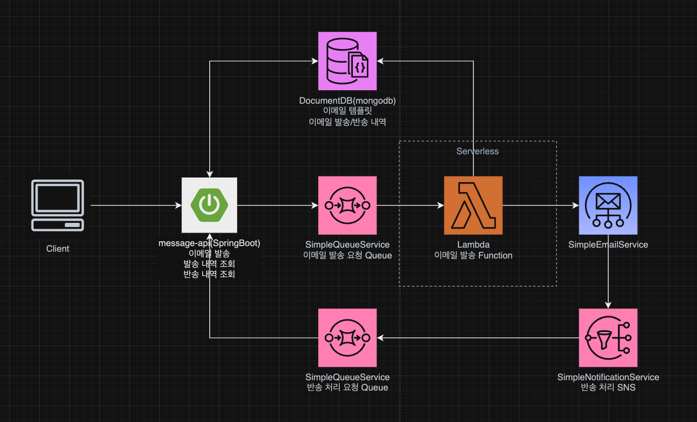

Meessage-api Application
==================================

## 개발 구성
* JDK 21.x
* SpringBoot 3.2.5
* WebFlux 적용(Route 방식)
* AWS DocumentDB(mongodb) 사용. spring-boot-starter-data-mongodb-reactive lib 사용
* AWS SDK 를 이용한 SimpleQueueService(SQS) 연결 비동기 처리.
* AWS Serverless 에서는 Serverless Framework V3 사용.(V4 부터 유료화 됨.)

## 아키텍처 구성

* SES와 연결까지 serverless만 구성하거나, SpringBoot Application 구성만으로도 가능하나, 기술 적용 테스트를 위한 아키텍처 구성 함.
* 실질적으로는 불필요한 구성이 포함 됨.

## 개발 사항
* Sample CRUD
* Email 발송 목록 조회
* Email 발송 요청
* 반송 Email 처리를 위한 SQS polling
* 공통 Exception 처리(ErrorCode에 에러 코드 정의하여, BaseException으로 공통 사용)
* 공통 Response 처리.(Flux의 경우 ServerResponse.body 내에 ArrayList로 처리되나, 공통 스펙을 위한 body Mono 처리)
* DocumentDB(mongodb) Cluster 구성 기준 셋팅.(Transaction 처리를 위해 ReadPreference Primary로 설정 함. 조회 기능만 있을 경우, Secondary 조회를 위해 @Transactional(readonly = true) 어노테이션 추가 필요)
* Request Test를 위한 test.java.ai.fassto.messageapi.RequestTest.http 에 정의.(Postman의 경우 개발자별로 테스트 구성하여 진행하기 때문에, 다수 사용을 위한 테스트 코드 정의.)

## 특이사항
* SES의 경우 90% 이상의 정상 발송률을 유지 해야함.
* 발송 실패율이 10% 이상 될 경우, AWS에서 SES 발송을 정지 시킴.
* 10% 이상 일 경우, 불법적인 스팸 메일 발송으로 간주 됨.
* 다시 활성화 필요시, AWS 측에 별도 요청 필요.
* 반송 Email 처리 된 내용 기준으로, 발송 요청이 되지 않도록 발송 제외 처리 필요. 안정적인 운영을 위해 최소 5% 이내로 정상 발송 비율 5% 이내로 유지 필요.

